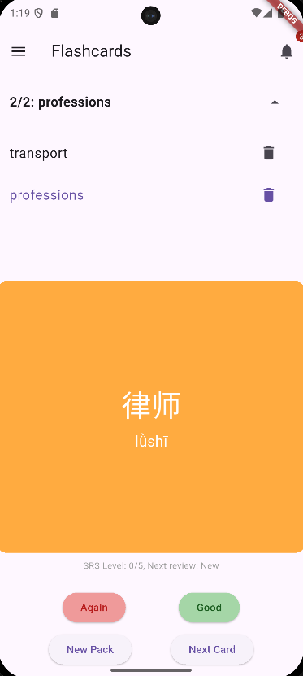
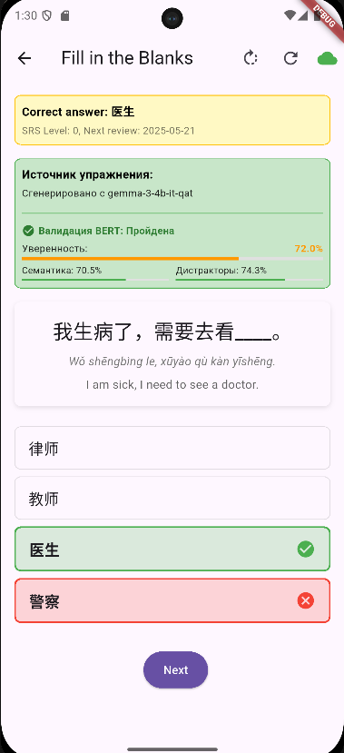

# Chinese Flashcards - NLP-powered Chinese Language Learning App

*[English](#overview) | [Русский](#обзор)*


## Overview

Chinese Flashcards is an innovative mobile application designed to help students learn Chinese through AI-generated "fill-in-the-blank" exercises created from authentic Chinese texts. The application leverages ChineseBERT, a specialized NLP model for Chinese language processing, to generate personalized learning content.

<div align="center">
  
</div>

## Features

### Flashcard System
Basic flashcard creation and review with categories for organizing your study materials.

<div align="center">
  
  
  
  
</div>

### Offline SRS Quiz System
Test your knowledge of characters with our Spaced Repetition System that works completely offline. Practice character writing, translation, and pronunciation using multiple input methods.

<div align="center">
  
  
  
  
  
</div>

### Memory Game
Interactive character matching game with multiple difficulty levels to improve character recognition.

<div align="center">
  
  
  
</div>

### AI-Powered Exercises
Personalized learning exercises generated using advanced NLP models with instant feedback.

<div align="center">
  
  
  
  
</div>

### Translation Service
Built-in translation capabilities with pinyin transcription.

<div align="center">
  
</div>

### User Settings and Localization
Customize your experience with dark/light themes and language preferences.

<div align="center">
  
  
  
</div>

### Backend Server
Powerful backend server for AI exercise generation and validation.

<div align="center">
  
  
  
</div>

## Key Features
- **Cross-platform**: Works on both iOS and Android devices
- **Flashcard System**: Create, edit, and review flashcards organized in categories
- **Offline SRS Quiz System**: Test character writing and pronunciation completely offline
- **Memory Game**: Interactive character matching game with multiple difficulty levels
- **AI-Powered Exercises**: "Fill-in-the-blank" exercises generated using NLP models
- **Dark/Light Mode**: Adjustable application theme
- **Personalized AI Learning System**:
  - Content generation using Gemma-3-4b-it-qat model
  - Content validation with BERT-Chinese-WWM model
  - Adaptive difficulty based on user performance
- **Character Writing Practice**:
  - Practice writing characters based on translations
  - Practice translating based on characters
  - Multiple input methods (system Chinese keyboard, drawing, voice input)
  - Pronunciation training through voice recognition
- **Translation Systems**:
  - Helsinki-NLP models for multi-language translations
  - BKRS website parser for additional reference
- **Multi-language support**: Interface available in English and Russian

### In Development
- **Detailed progress tracking**: Advanced learning statistics
- **Advanced Memory Games**: Additional games for improving character recognition

## Technologies Used
- **Frontend**: Flutter/Dart
- **Backend**: FastAPI (Python)
- **NLP Models**: 
  - Gemma-3-4b-it-qat for exercise generation
  - BERT-Chinese-WWM for content validation
  - Helsinki-NLP for translations
- **Database**: SQLite (local), PostgreSQL (server)
- **State Management**: Provider

## Installation

```bash
# Clone the repository
git clone https://github.com/AndrewTheMaster/flashcardsapp.git

# Navigate to the project directory
cd flashcardsapp

# Install Flutter dependencies
flutter pub get

# Install Python server dependencies
cd server/chinese-tutor-api
pip install -r requirements.txt

# Run the application
flutter run
```

## Running the Server

The application requires the backend server to generate exercises and provide translations. The server requires LM Studio with the Gemma-3-4b-it-qat model to be running on your computer (not on the mobile device).

### Windows
```bash
# Navigate to the server directory
cd server/chinese-tutor-api

# Option 1: Using the batch file (recommended)
run_server.bat

# Option 2: Direct Python command
python run_server.py
```

### Linux/Mac
```bash
# Navigate to the server directory
cd server/chinese-tutor-api

# Make the script executable
chmod +x run_server.sh

# Run the server
./run_server.sh
```

### Server Configuration Options
- Default port: 5000 (can be changed during startup)
- LM Studio: Must be running on your computer with the Gemma-3-4b-it-qat model loaded
- LM Studio integration: Use the full URL with protocol (e.g., http://192.168.x.x:1234)
- Mobile connection: 
  - For emulators: Use 10.0.2.2:5000
  - For real devices: Use your computer's local IP address

## Project Cleanup

Before committing to Git, run the cleanup script to remove build artifacts and large model files:

```bash
# Windows
.\clean_project.ps1

# Linux/Mac
# First make the script executable
chmod +x clean_project.sh
./clean_project.sh
```

## Contributing

Contributions are welcome! Please feel free to submit a Pull Request.

---

# Chinese Flashcards - приложение для изучения китайского с поддержкой NLP

*[English](#overview) | [Русский](#обзор)*


## Обзор

Chinese Flashcards - это инновационное мобильное приложение, разработанное для помощи студентам в изучении китайского языка через упражнения "заполни пропуск", созданные с помощью ИИ на основе аутентичных китайских текстов. Приложение использует ChineseBERT, специализированную NLP-модель для обработки китайского языка, чтобы генерировать персонализированный учебный контент.

<div align="center">
  
</div>

## Функции

### Система флэш-карточек
Базовое создание и просмотр карточек с категориями для организации учебных материалов.

<div align="center">
  
  
  
  
</div>

### Офлайн система тестирования SRS
Тестируйте свои знания иероглифов с помощью нашей системы интервальных повторений, работающей полностью офлайн. Практикуйте написание иероглифов, перевод и произношение с использованием различных методов ввода.

<div align="center">
  
  
  
  
  
</div>

### Игра на память
Интерактивная игра на сопоставление иероглифов с уровнями сложности для улучшения распознавания символов.

<div align="center">
  
  
  
</div>

### Упражнения с поддержкой ИИ
Персонализированные учебные упражнения, созданные с использованием продвинутых NLP моделей с мгновенной обратной связью.

<div align="center">
  
  
  
  
</div>

### Сервис перевода
Встроенные возможности перевода с транскрипцией пиньинь.

<div align="center">
  
</div>

### Настройки пользователя и локализация
Настройте свой опыт с темной/светлой темой и предпочтениями по языку.

<div align="center">
  
  
  
</div>

### Серверная часть
Мощный бэкенд-сервер для генерации и валидации упражнений с ИИ.

<div align="center">
  
  
  
</div>

## Основные возможности
- **Кроссплатформенность**: Работает на устройствах iOS и Android
- **Система флэш-карточек**: Создание, редактирование и просмотр карточек, организованных по категориям
- **Офлайн система тестирования SRS**: Тестирование написания и произношения иероглифов полностью офлайн
- **Игра на память**: Интерактивная игра на сопоставление иероглифов с несколькими уровнями сложности
- **Упражнения с поддержкой ИИ**: Упражнения "заполни пропуск", сгенерированные с использованием NLP моделей
- **Темный/светлый режим**: Настраиваемая тема приложения
- **Персонализированная система обучения с ИИ**:
  - Генерация контента с использованием модели Gemma-3-4b-it-qat
  - Валидация контента с помощью модели BERT-Chinese-WWM
  - Адаптивная сложность на основе успеваемости пользователя
- **Практика написания иероглифов**:
  - Тренировка написания иероглифов на основе перевода
  - Тренировка перевода на основе иероглифов
  - Множественные методы ввода (системная китайская клавиатура, рисование, голосовой ввод)
  - Тренировка произношения через распознавание голоса
- **Системы перевода**:
  - Модели Helsinki-NLP для многоязычных переводов
  - Парсер сайта БКРС для дополнительной справки
- **Многоязычная поддержка**: Интерфейс доступен на английском и русском языках

### В разработке
- **Детальное отслеживание прогресса**: Расширенная статистика обучения
- **Продвинутые игры на запоминание**: Дополнительные игры для улучшения распознавания иероглифов

## Используемые технологии
- **Фронтенд**: Flutter/Dart
- **Бэкенд**: FastAPI (Python)
- **NLP-модели**: 
  - Gemma-3-4b-it-qat для генерации упражнений
  - BERT-Chinese-WWM для валидации контента
  - Helsinki-NLP для переводов
- **База данных**: SQLite (локальная), PostgreSQL (серверная)
- **Управление состоянием**: Provider

## Установка

```bash
# Клонировать репозиторий
git clone https://github.com/AndrewTheMaster/flashcardsapp.git

# Перейти в директорию проекта
cd flashcardsapp

# Установить зависимости Flutter
flutter pub get

# Установить зависимости для Python-сервера
cd server/chinese-tutor-api
pip install -r requirements.txt

# Запустить приложение
flutter run
```

## Запуск сервера

Приложение требует работающий бэкенд-сервер для генерации упражнений и предоставления переводов. Для работы сервера необходимо запустить LM Studio с моделью Gemma-3-4b-it-qat на вашем компьютере (не на мобильном устройстве).

### Windows
```bash
# Перейти в директорию сервера
cd server/chinese-tutor-api

# Вариант 1: Использование batch-файла (рекомендуется)
run_server.bat

# Вариант 2: Прямая команда Python
python run_server.py
```

### Linux/Mac
```bash
# Перейти в директорию сервера
cd server/chinese-tutor-api

# Сделать скрипт исполняемым
chmod +x run_server.sh

# Запустить сервер
./run_server.sh
```

### Параметры конфигурации сервера
- Порт по умолчанию: 5000 (может быть изменен при запуске)
- LM Studio: Должен быть запущен на вашем компьютере с загруженной моделью Gemma-3-4b-it-qat
- Интеграция с LM Studio: Используйте полный URL с протоколом (например, http://192.168.x.x:1234)
- Подключение мобильного устройства: 
  - Для эмуляторов: Используйте 10.0.2.2:5000
  - Для реальных устройств: Используйте локальный IP-адрес вашего компьютера

## Очистка проекта

Перед коммитом в Git, запустите скрипт очистки для удаления артефактов сборки и больших файлов моделей:

```bash
# Windows
.\clean_project.ps1

# Linux/Mac
# Сначала сделайте скрипт исполняемым
chmod +x clean_project.sh
./clean_project.sh
```

## Вклад в проект

Мы приветствуем вклад в проект! Не стесняйтесь отправлять Pull Request.
